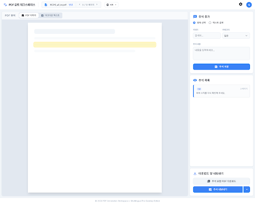

# DocRev: AI-Powered PDF Review & Annotation System

DocRev is a professional, multilingual PDF review platform that leverages AI to automate document auditing, provide context-aware Q&A, and manage organizational guidelines through RAG (Retrieval-Augmented Generation).



## 🌟 Key Features

### 1. Intelligent PDF Workspace
- **Interactive Annotation**: Support for both text-based highlighting and area-based selection.
- **AI Analysis**: Automate document reviews with **Simple Review** and **Deep Review** modes.
- **Precise Highlighting**: Character-level accuracy for keyword-based highlights.
- **Export Capabilities**: Export annotated PDFs or extracted metadata in CSV, JSON, and JSONL formats.

### 2. Document Q&A (RAG)
- **Contextual Chat**: Draggable, interactive chat widget to ask questions directly about the document.
- **Reference Management**: Dedicated UI to upload and manage reference documents used for RAG reconstruction.
- **Real-time Status**: Background task monitoring for document parsing and embedding.

### 3. Compliance & Guideline Management
- **NG Words Filtering**: Manage prohibited words and guidelines with automated violation detection.
- **Recommendation Phrases**: Provide AI-generated suggestions for fixing compliance issues.

### 4. Global Multilingual Support
- Fully localized interface for **Korean**, **Japanese**, and **English**.
- Automatic UI synchronization and language-specific prompting.
- Dynamic dark/light mode support.

## 🛠 Tech Stack

- **Frontend**: HTML5, Vanilla JavaScript, Tailwind CSS, [PDF.js](https://mozilla.github.io/pdf.js/), [pdf-lib](https://pdf-lib.js.org/).
- **Backend**: Python, Flask, [LangChain](https://www.langchain.com/).
- **AI/LLM**: Support for OpenAI, Gemini, and Ollama (configurable via `.env`).
- **Storage**: JSON-based dataset management and vector store integrations.

## 🚀 Getting Started

### Prerequisites
- Python 3.8+
- Node.js (for optional development tools)

### Installation
1. Clone the repository:
   ```bash
   git clone https://github.com/your-username/DocRev.git
   cd DocRev
   ```
2. Set up a virtual environment and install dependencies:
   ```bash
   python -m venv .venv
   source .venv/bin/activate  # On Windows: .venv\Scripts\activate
   pip install -r requirements.txt
   ```
3. Configure environment variables:
   - Create a `.env` file based on `.env.example`.
   - Add your API keys (OPENAI_API_KEY, etc.).

### Running the Service
Use the provided batch script for easy startup on Windows:
```bash
./run_service.bat
```
Or run the backend directly:
```bash
python backend.py
```
Then open `pdf_comment_workspace.html` in your browser.

## 📂 Project Structure
- `pdf_comment_workspace.html`: Main PDF annotation and review workspace.
- `rag_management.html`: UI for managing RAG reference documents.
- `ng_words_management.html`: Dashboard for compliance guidelines and prohibited words.
- `backend.py`: Flask server handling AI analysis, RAG, and PDF processing.

## 📄 License
This project is licensed under the MIT License.
